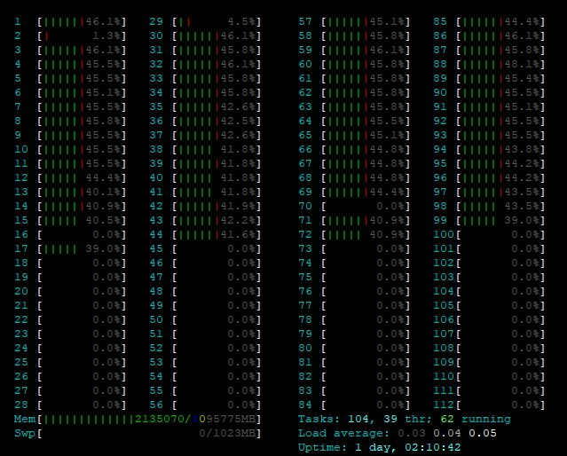
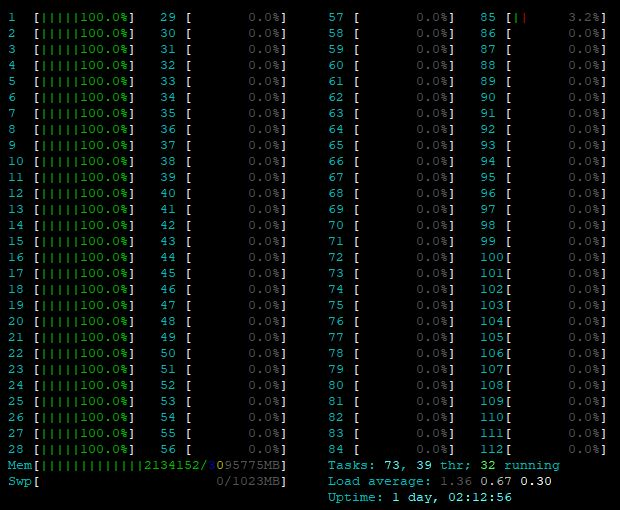
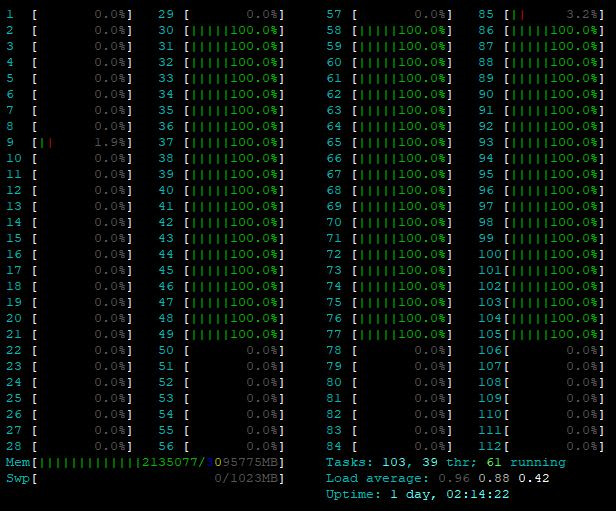

# atxTester

## Purpose
This tool was created to generate a workload allowing to demonstrate the capabilities of HPE ATX.

HPE ATX controls and optimizes the location of processes and threads in a NUMA server.

## Architecture
atxTester is a single Python program generating 2 levels of sub-processes:

1 the "parents" processes 

2 the child processes, obviously created by the parents

## Usage
1 download atxtester.py or atxTester.zip in the release tab

2 unzip atxTester.zip

3 run it as `python atxtester.py`

Altough Python 3 is recommended, both Python version 2 and 3 work.
Once atxTester is started, one need to provide the number of parents and the number of child. These values are usually related to the number of NUMA nodes and cores.
i
For instance:

`# python atxTester.py`

`How many Parent jobs? 4`

`How many Child jobs? 10`

## Examples
Round robin placement for all parents and childs:

`# hpe-atx -p rr_tree python atxTester.py`

`How many Parent jobs? 4`

`How many Child jobs? 15`

Packed placement for all parents and childs:

`# hpe-atx -p rr_tree python atxTester.py`

`How many Parent jobs? 3`

`How many Child jobs? 10`

Round robin placement for all parents and pack for the childs:

`# hpe-atx -p rr_pack python atxTester.py`

`How many Parent jobs? 3`

`How many Child jobs? 20`

## Links
1 HPE Application Tuner Express [ATX Page](https://downloads.linux.hpe.com/SDR/project/hpe-atx/index.html)

2 HPE ATX documentation [page](http://downloads.linux.hpe.com/SDR/project/hpe-atx/Using_HPE-ATX_v_1.0.2.pdf)

3 htop monitoring [page](https://hisham.hm/htop/)
